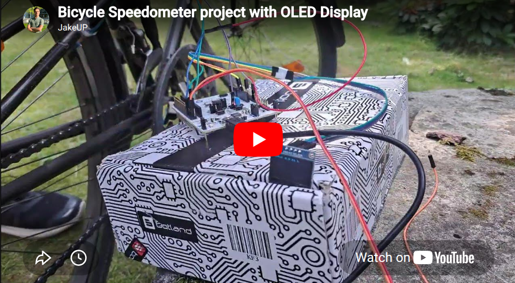

# Bicycle Speedometer with OLED Display

A real-time bicycle speedometer built using the STM32F446RE microcontroller, a Hall effect sensor, and an SSD1306 OLED display. The project was developed in STM32CubeIDE and uses FreeRTOS for multitasking and real-time task scheduling.

[](https://youtu.be/KIXGy_-FDHw?si=S9tv5LFiRT5-yjg3)

---

## Overview

This project measures bicycle wheel rotation using a Hall effect sensor and converts the detected pulses into real-time speed readings displayed on a 1.3" OLED screen.

The system was designed as an embedded systems project focused on:

- Real-time embedded programming
- Sensor interfacing
- FreeRTOS task scheduling
- I2C communication
- Signal filtering and smoothing
- STM32 HAL driver development

---

## Features

- Real-time speed measurement in km/h
- SSD1306 OLED display output
- Hall effect magnetic pulse detection
- FreeRTOS multitasking architecture
- Moving average filtering with min-max rejection
- Timeout detection when the bicycle stops
- Glitch filtering for false pulse spikes
- LED debugging and task monitoring system

---

## Hardware Components

| Component | Description |
|---|---|
| STM32F446RE | ARM Cortex-M4 development board |
| Hall Effect Sensor (Iduino SE014) | Detects wheel magnet pulses |
| SSD1306 OLED Display | 1.3" I2C OLED display |
| Magnet | Mounted on bicycle wheel |
| LED | Debugging and task monitoring |
| External USB Power Supply | 5V supply |

---

## System Schematic


---

## Project Photos

### Full Prototype


### OLED Speed Display


---

## Software Architecture

The project uses **FreeRTOS** to separate functionality into concurrent real-time tasks.

| Task | Purpose |
|---|---|
| SensorRead_Task | Reads Hall sensor pulses and calculates speed |
| Display_Task | Updates OLED display via I2C |
| LEDFlash_Task | Controls debugging LED blinking |
| LEDReset_Task | Resets LED frequency |
| ReadButton_Task | Reads button input for LED frequency control |

---

## Speed Calculation Logic

### Pulse Detection

The Hall effect sensor detects wheel rotation using a magnet attached to the wheel.

The STM32 detects a rising edge transition:

```c
last_state == GPIO_PIN_RESET &&
current_state == GPIO_PIN_SET
```

---

### Time Measurement

The system measures the time between pulses using:

```c
HAL_GetTick()
```

---

### Speed Formula

Speed is calculated using:

```math
v = \frac{C}{\Delta t} \cdot 3.6
```

Where:

- `v` = speed in km/h
- `C` = wheel circumference in meters
- `Δt` = time between wheel rotations in seconds
- `3.6` converts m/s into km/h

---

### Filtering & Smoothing

To improve measurement stability, the project implements:

- Moving average filtering
- Min-max rejection
- Spike filtering
- Timeout handling

Filtering equation:

```math
avg = \frac{\sum x_i - x_{min} - x_{max}}{N - 2}
```

Where:

- `avg` = filtered average speed
- `x_i` = collected speed samples
- `x_min` = minimum sample value
- `x_max` = maximum sample value
- `N` = total number of samples

This helps eliminate:

- Electrical noise
- False triggers
- Startup glitches
- Low-speed instability

---

## OLED Display

The SSD1306 OLED display communicates over I2C.

Example display update:

```c
snprintf(buffer, sizeof(buffer),
         "Speed: %.1f km/h",
         calculated_speed);

ssd1306_write_string(buffer);
```

---

## Development Environment

- STM32CubeIDE
- STM32 HAL Drivers
- FreeRTOS
- Embedded C

---

## Key Embedded Concepts Used

- GPIO interrupt-style polling
- I2C communication
- RTOS multitasking
- Real-time timing
- Signal filtering
- Hardware abstraction layer (HAL)
- Concurrent task scheduling

---

## Challenges Encountered

Some issues encountered during development included:

- OLED flickering
- I2C initialization issues
- Hall sensor false triggering
- Speed spikes at startup
- Low-speed measurement instability

Solutions involved:

- Optimized OLED refresh rates
- Improved filtering algorithms
- Timeout logic
- Better GPIO configuration
- Debugging using FreeRTOS LED tasks


